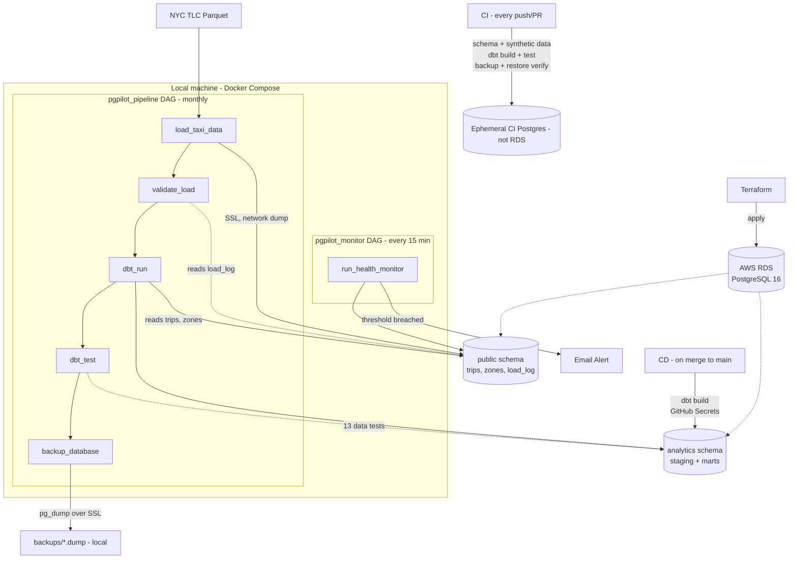
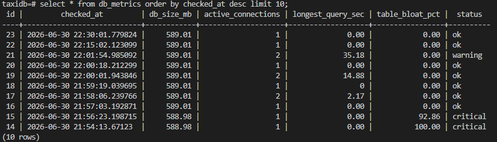
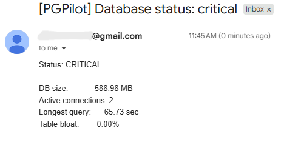
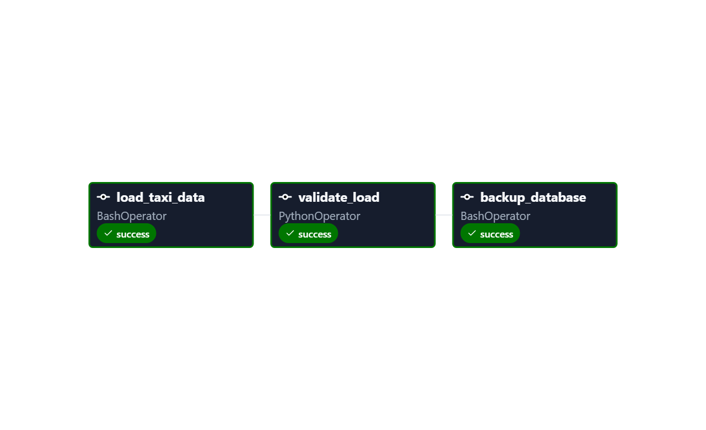
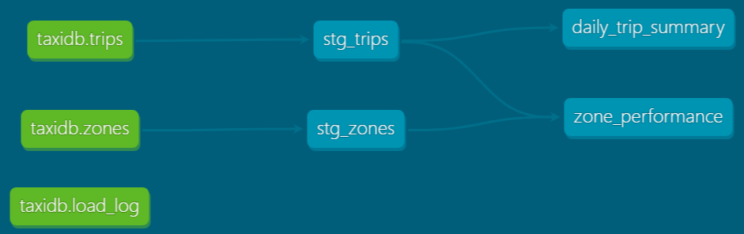

# PGPilot

>*A PostgreSQL operations toolkit built on real NYC taxi data — provisioned on AWS RDS with Terraform, orchestrated with Apache Airflow, transformed and tested with dbt, and covering data ingestion, automated backups, health monitoring, and a full CI/CD pipeline via GitHub Actions.*


## About
PGPilot is a database operations toolkit built around a real-world NYC taxi dataset. The primary purpose of this project was to learn and build my skills in concepts commonly seen in DevOps roles. This includes things like containerization, continuous integration, monitoring and logging, and automation.

## Features

- Ingested and cleaned 3.8M rows of real NYC Yellow Taxi trip data, rejecting 26,585 rows (0.69%) based on documented business logic rules
- Bulk-loaded data using Postgres's native `COPY` command, then benchmarked index performance before and after with `EXPLAIN ANALYZE`
- Provisioned on AWS RDS (PostgreSQL 16) entirely through Terraform: a subnet group, a security group, an SSL-enforcing parameter group, and the instance itself from a single `terraform apply`
- Orchestrated with Apache Airflow: a five-task pipeline DAG (`load → validate → transform → test → backup`) with two fail-fast data-quality gates, plus a separate 15-minute health-monitoring DAG
- Transformed and tested with dbt: staging models standardize the loaded tables, mart models build daily and per-zone rollups, and 13 automated tests enforce key integrity, referential integrity, and accepted values
- Automated `pg_dump` backups with 7-day rotation and log management over an SSL network connection, triggered by Airflow only after a load passes validation and its dbt-modelled data passes every test
- Verified restore integrity end-to-end: drops the `trips` table, restores from the dump, then confirms row counts, foreign key constraints, and indexes all match the pre-drop state
- Monitors four database health metrics via Postgres system views with threshold-based SMTP email alerting
- Full CI/CD via GitHub Actions: CI validates the schema, dbt models, Terraform, and every DAG on push/PR; CD deploys dbt models to the live cloud database on merge to `main`, gated by branch protection

## Tech Stack

| Tool | Role |
|---|---|
| PostgreSQL 16 | Primary database (AWS RDS) |
| Terraform | Infrastructure as code — provisions RDS, networking |
| AWS (RDS, VPC) | Managed database hosting and networking |
| Python, pandas, psycopg2 | Data ingestion and monitoring pipeline |
| Apache Airflow | Pipeline orchestration and scheduling |
| dbt (dbt-postgres) | SQL transformation, testing, and documentation |
| Bash | Backup, restore, and log management scripts |
| Docker, Docker Compose | Containerization |
| GitHub Actions | CI/CD pipeline |
| smtplib | SMTP email alerting |

## Architecture



## Loading Data

[scripts/load_data.py](scripts/load_data.py) is a data engineering pipeline that ingests NYC TLC's public Yellow Taxi Trip Records, cleans them, and bulk-loads them into Postgres. It turns a single month of data (~3.8M rows) into a realistic operational dataset for testing backup, monitoring, and performance-tuning workflows.

### Data cleaning

Several rows in the dataset were dropped due to containing logical errors.

| Rule | Reasoning |
|---|---|
| `fare_amount < 0` / `total_amount < 0` | A fare cannot be negative |
| `passenger_count = 0` | A completed fare implies at least one rider. Nulls are kept since they represent a real, documented "Flex Fare" trip type with no metered passenger count, not bad data. |
| `dropoff_datetime < pickup_datetime` | A trip cannot end before it starts |
| pickup outside the file's month | Only focused on trips during April 2026 |
| null pickup/dropoff zone | Required to satisfy the FK into the `zones` lookup table |

On the April 2026 file: **3,831,240 rows read → 3,804,655 loaded, 26,585 rejected (0.69%)**, the bulk of which were negative fare/total amounts.

### Bulk loading

Rows are loaded with psycopg2's `copy_expert()` (Postgres's native `COPY ... FROM STDIN`) rather than row-by-row `INSERT`s. The entire cleaned dataset is staged into an in-memory CSV buffer and streamed to Postgres in one pass. This method is significantly more efficient than row-by-row inserts.

### Indexing and performance tuning

Indexes on `pickup_datetime` and `total_amount` are added **after** the bulk load, not before. Building them during the load would force Postgres to update both indexes on every inserted row, slowing down the process. Before/after performance is measured directly with `EXPLAIN ANALYZE` and logged to an `index_benchmark` table:

| Query | Before (Seq Scan) | After (Index Scan) | Speedup |
|---|---|---|---|
| `pickup_datetime` between date range | 152.70 ms | 27.96 ms | **5.5x** |
| `total_amount > 100` | 235.79 ms | 183.76 ms | **1.3x** |

The two indexes deliver very different speedups despite similarly selective queries. `pg_stats.correlation` explains why: `pickup_datetime` is `0.68` (i.e. rows were loaded in roughly chronological order, so matching rows sit on a small number of adjacent disk pages) versus `0.15` for `total_amount` (i.e. high-fare trips are scattered randomly across the table, so even a precise index still has to fetch from thousands of scattered pages). An index's payoff depends on how well the indexed column correlates with the table's physical row order, not just on how selective the query is.

### Auditability

Every run of `load_data.py` records its own row counts, rejection counts, and timing breakdown to a `load_log` table, giving a persistent, queryable history of every load rather than relying on console output or memory.

## Backup & Recovery

[scripts/backup.sh](scripts/backup.sh) and [scripts/restore.sh](scripts/restore.sh) handle backing up and recovering the database via `pg_dump`/`pg_restore`, connecting directly over the network to whatever `DB_HOST` points at — the local Postgres container or the RDS endpoint. Both scripts run from inside the Airflow container, which carries a Postgres 16 client matching RDS's engine version (see [Cloud Infrastructure](#cloud-infrastructure-terraform--aws-rds)).

**Manual backup:**

```
./scripts/backup.sh
```

This dumps the database to a timestamped, compressed file in `backups/` (e.g. `taxidb_20260627_194658.dump`), logs the run to `logs/backup.log`, and deletes any `.dump` file older than 7 days.

**Manual restore:**

```
./scripts/restore.sh ./backups/taxidb_20260627_194658.dump
```

`restore.sh` uses `pg_restore --clean --if-exists`, so it safely drops and recreates only the objects present in the dump before reloading data. This includes any tables, indexes, or foreign keys that may have been dropped or modified since the backup was taken.

### Verified restore test

Tested end-to-end: dropped the `vendors` table entirely (cascading its foreign key into `trips`), then ran `restore.sh` against a prior backup. Both the table and the FK constraint were recreated automatically, and row counts matched exactly.

### Backup rotation

`.dump` files older than 7 days are deleted automatically on each `backup.sh` run via `find ... -mtime +7 -delete`. Recent backups are never touched.

### Log rotation

Backup rotation (pruning old `.dump` files) and log rotation (managing `backup.log` growth) are handled separately. Once `backup.log` exceeds 1MB, it's archived to a timestamped `.old` file and a fresh log starts. Archived logs older than 30 days are pruned on the next run.

### Scheduling

Backups are triggered by Apache Airflow's `pgpilot_pipeline` DAG ([airflow/dags/pgpilot_pipeline.py](airflow/dags/pgpilot_pipeline.py)) as the fifth step of the pipeline, running monthly to match how often the TLC actually publishes new data. `backup_database` invokes the existing, unmodified `backup.sh` through Airflow's `BashOperator`. See [Orchestration](#orchestration) for why this replaced the original `cron` sidecar, and [Cloud Infrastructure](#cloud-infrastructure-terraform--aws-rds) for why the transport is now a network `pg_dump` rather than `docker exec`.

## Health Monitoring & Alerting

[scripts/monitor.py](scripts/monitor.py) polls the database every 15 minutes via Airflow's `pgpilot_monitor` DAG, collects four health metrics from Postgres's built-in system views, and sends an email alert if any metric crosses a warning or critical threshold.

**Manual run:**

```
python scripts/monitor.py
```

Use `--dry-run` to verify the full pipeline without sending email:

```
python scripts/monitor.py --dry-run
```

### What is monitored

| Metric | Why it matters |
|---|---|
| `db_size_mb` | Catches runaway data growth before it fills the disk |
| `active_connections` | Postgres has a hard connection cap; exhausting it refuses all new connections |
| `longest_query_sec` | A query running longer than expected is usually blocking others or missing an index |
| `table_bloat_pct` | Dead rows accumulate until VACUUM reclaims them; high bloat degrades query performance |

### Persistent history

Every run inserts a row into `db_metrics` regardless of status, giving a queryable record of database health over time. This makes it possible to spot gradual trends that a single snapshot wouldn't reveal.



*Monitoring results stored in the db_metrics table.*

### Alerting

When any metric crosses a threshold, an email is sent via SMTP with the metric values and status level. Thresholds are defined as named constants at the top of [scripts/monitor.py](scripts/monitor.py) and can be tuned to match the environment's normal baseline. `--dry-run` prints the alert body to the terminal instead of sending, making it safe to test without live email credentials.



*Alert sent to email when critical threshold is surpassed.*

### Scheduling

The monitor runs every 15 minutes via Airflow's `pgpilot_monitor` DAG ([airflow/dags/pgpilot_monitor.py](airflow/dags/pgpilot_monitor.py)), a single-task DAG kept separate from the pipeline DAG since health checks need a much tighter cadence than a monthly data load. Each run's output is captured in the Airflow UI's per-task logs.

## Orchestration

[Apache Airflow](https://airflow.apache.org/) replaces the original `cron` sidecar. Two DAGs wrap the existing scripts as tasks — [pgpilot_pipeline.py](airflow/dags/pgpilot_pipeline.py) and [pgpilot_monitor.py](airflow/dags/pgpilot_monitor.py) — without rewriting any of `load_data.py`, `backup.sh`, or `monitor.py`.

**`pgpilot_pipeline`** runs monthly, matching TLC's data-drop cadence, as a real dependency chain: `load_taxi_data → validate_load → dbt_run → dbt_test → backup_database`. `validate_load` reads the latest `load_log` row and fails the DAG if the load inserted zero rows or the rejection ratio exceeds 5%. `dbt_test` then runs a second, complementary gate — see [Transformation & Data Quality](#transformation--data-quality-dbt) — so a backup only happens after both the raw load and the modelled data have proven sound.

**`pgpilot_monitor`** runs independently every 15 minutes, since health checks need a tighter cadence than a monthly load.



*A completed `pgpilot_pipeline` run — each box names its Airflow operator type (`BashOperator`, `PythonOperator`) and its outcome.*

### Design choices

- **LocalExecutor**, not the official Compose file's default `CeleryExecutor` — single-machine task execution needs no message broker or worker pool for local development.
- **A separate metadata database** (`airflow-db`) tracks DAG runs and task state, entirely distinct from `taxidb`. Confusing the two is the most common Airflow setup mistake.
- **A custom image** ([Dockerfile.airflow](Dockerfile.airflow)) adds the same Python dependencies the scripts already need, plus a Postgres 16 client matching RDS's engine version so `backup.sh`/`restore.sh` can `pg_dump`/`pg_restore` it directly.
- **dbt in its own virtualenv** (`/opt/dbt-venv`), not installed alongside Airflow's own Python packages. dbt and Airflow pin overlapping dependencies, so sharing one environment is a well-known way to get a pip conflict; the DAG calls dbt by its full venv path instead.
- **No standalone daily backup DAG.** Data only changes on a monthly load, so a backup gated on a validated load is more meaningful than a fixed 2am snapshot of an unchanged database.

### Running it

```
docker compose up -d --build
```

This starts Airflow pointed at whatever `DB_HOST` in `.env` says — the RDS endpoint by default now. To work fully offline instead, add `--profile local` to bring up the local Postgres container too, and set `DB_HOST=postgres` in `.env`.

Open `http://localhost:8080` (`airflow` / `airflow`, set in `.env`), unpause `pgpilot_pipeline` and `pgpilot_monitor`, and trigger a run from the UI. Every task's logs are captured per run — a direct upgrade over `cron`'s flat log files.

## Transformation & Data Quality (dbt)

[dbt](https://www.getdbt.com/) sits on top of the already-loaded data, layered rather than replacing anything. `load_data.py` still does all the cleaning, exactly as before; dbt treats the resulting `trips` and `zones` tables as **sources**, then builds further modelling and — the part that matters most here — automated data-quality tests on top. This is deliberate: it adds a real dbt transformation and testing layer over an existing Python ETL load, not a rewrite of it.

Raw and modelled data are kept in separate Postgres schemas so it's always obvious which is which: `load_data.py` writes to `public`, dbt builds everything in `analytics`.

### Staging and marts

- **Staging** (`stg_trips`, `stg_zones`) — lightweight views that standardize column names and add a couple of derived fields (`pickup_date`, `trip_minutes`). No cleaning happens here; that already happened in Python.
- **Marts** (`daily_trip_summary`, `zone_performance`) — analytics-ready tables, one row per day and one row per pickup zone respectively, aggregating trip volume, revenue, and averages. Materialized as tables (not views) so they're fast to query.

`{{ ref(...) }}` calls in the mart SQL are what tell dbt the build order (staging before marts) and let it draw the lineage graph below — that ordering is never managed by hand.

### Data-quality tests

13 tests run via `dbt test`, all passing:

| Test type | What it catches |
|---|---|
| `unique` / `not_null` on keys | Duplicate or missing trip and zone identifiers |
| `relationships` | A trip whose pickup zone doesn't actually exist in the zone lookup — genuine referential-integrity testing |
| `accepted_values` | A `payment_type` code outside the documented set (0 through 6) |
| Source freshness | Whether the newest `load_log` row is over 12 hours old (warn) or 24 hours old (error) |

A failing `relationships` test means the data really does have an orphaned foreign key — that's a finding to investigate, not a test to delete.



*dbt's generated docs site: `trips`/`zones`/`load_log` sources flowing through staging into marts, with every test attached to its model.*

### Wired into the pipeline

`dbt_run` and `dbt_test` are two more tasks in the `pgpilot_pipeline` DAG — see [Orchestration](#orchestration) for the full five-task chain. `validate_load` (operational: did the load run, is the reject ratio sane) and `dbt_test` (data quality: uniqueness, nulls, referential integrity, accepted values) are complementary gates, not redundant ones — a failing test at either stage stops the pipeline before anything gets backed up.

### Running it locally

With `DB_HOST`, `DB_NAME`, `DB_USER`, and `DB_PASSWORD` set in your shell (`taxidb` already exposes port 5432 to the host, so `DB_HOST=localhost` reaches it directly):

```
cd dbt
dbt run --profiles-dir .
dbt test --profiles-dir .
dbt source freshness --profiles-dir .
```

Preview the docs site — the same lineage graph screenshotted above:

```
dbt docs generate --profiles-dir .
dbt docs serve --profiles-dir . --port 8081
```

Port 8081, not the default 8080, since Airflow already occupies that one.

## Cloud Infrastructure (Terraform + AWS RDS)

The database moved from a local Docker container to a managed [AWS RDS](https://aws.amazon.com/rds/) PostgreSQL 16 instance, provisioned entirely through [Terraform](https://www.terraform.io/) — no console clicks. Airflow, dbt, and every script still run locally in Docker exactly as before; only their connection target changed, since every connection was already parameterized through `DB_HOST`/`DB_NAME`/`DB_USER`/`DB_PASSWORD` from Phases 1 and 2.

### What Terraform provisions

[terraform/main.tf](terraform/main.tf) creates five resources from a single `terraform apply`:

- An `aws_db_instance` — PostgreSQL 16, `db.t3.micro`, 20GB `gp3` storage, single-AZ — sized to stay inside AWS's 12-month free tier.
- An `aws_db_subnet_group` and `aws_security_group` in the account's default VPC.
- An `aws_db_parameter_group` that sets `rds.force_ssl = 1`, making SSL mandatory at the server rather than merely requested by the client.
- A `random_password` resource that generates the master password. This is a deliberate cost tradeoff, covered below.

### Provisioning and teardown

```
cd terraform
terraform init
terraform plan
terraform apply
```

`terraform output db_endpoint` and `terraform output -raw db_password` retrieve the connection details, which go into `.env` (`DB_HOST`, `DB_USER=pgpilot_admin`, `DB_PASSWORD`, `PGSSLMODE=require`).

```
terraform destroy
```

tears it all down. Since RDS bills by the hour whether or not it's in use, destroying the instance between working sessions is the actual safety mechanism — not a nice-to-have. A budget alert is also configured in the AWS Billing console as a backstop.

### Local Postgres, parked not deleted

The original local `postgres` service (`taxidb`) is still in `docker-compose.yml`, now behind a Compose profile so it no longer starts by default:

```
docker compose --profile local up -d
```

Switching between local and cloud is just toggling `DB_HOST` in `.env` — nothing else in the stack changes.

### Design choices and honest simplifications

- **`publicly_accessible = true`, secured by password + SSL rather than network isolation.** Phase 3 locked the security group to a single home IP; Phase 4 opened it to `0.0.0.0/0` so GitHub-hosted CD runners (no fixed IP) can reach it too — see [CI/CD](#cicd) for the full reasoning and the `rds.force_ssl` hardening that went with it. A production system would instead put RDS in a private subnet with no public route at all, reachable only from inside the VPC (e.g. via a bastion host, VPN, or a self-hosted runner inside the VPC). This is a portfolio-scale simplification, not a production pattern.
- **The default VPC, not a custom one.** Using the account's default VPC and its existing subnets avoids hundreds of lines of networking code while still exercising the two concepts RDS actually requires: subnet groups and security groups.
- **A broad IAM policy** (`AmazonRDSFullAccess` + `AmazonVPCFullAccess`) on the Terraform user, rather than a least-privilege custom policy scoped to exactly the actions this project needs. Standard practice for a single-developer portfolio project; not what a production IAM setup would look like.
- **Password generated by Terraform, not AWS Secrets Manager.** This is the one worth explaining in full, next.

### Secrets management tradeoff

The RDS master password is generated by Terraform's `random_password` resource and stored in local, gitignored Terraform state — not in AWS Secrets Manager. This was a deliberate choice: Secrets Manager charges roughly $0.40/month per secret, which is a real (if small) recurring cost, and this project's goal was to stay inside the free tier with **no recurring cost at all**.

The tradeoff: the plaintext password lives in `terraform.tfstate`, which never leaves the local machine and is gitignored, but is consequently a single file that must not be lost or committed. A production-grade hardening step would be `manage_master_user_password = true` on the `aws_db_instance` resource, letting RDS generate and auto-rotate the credential inside Secrets Manager, with the application reading it at runtime instead of from an environment file. That's the natural next step if this were a real production database rather than a portfolio project optimized to run at zero cost.

### A real bug this surfaced: SSL and Airflow's own metadata database

Setting `PGSSLMODE=require` globally so `pg_dump`/`pg_restore`/psycopg2 connect to RDS over SSL has a side effect: it's a process-wide libpq setting, so it also applies to Airflow's *own* internal connection to its metadata database (`airflow-db`), a plain local Postgres container with no SSL configured at all — breaking every Airflow container's health check with `server does not support SSL, but SSL was required`. The fix was scoping `sslmode=disable` explicitly into `AIRFLOW__DATABASE__SQL_ALCHEMY_CONN`'s connection string, since an explicit value in a connection string always overrides the environment variable. `PGSSLMODE=require` still applies correctly to every connection the pipeline scripts make to RDS — just not to Airflow's unrelated internal one.

## CI/CD

PGPilot has a genuine CI/CD pipeline through GitHub Actions — two workflows with distinct jobs, distinct triggers, and distinct scope. Precision matters here: CI proves nothing is broken; CD is the only stage that touches the real cloud database.

### Continuous Integration — [.github/workflows/ci.yml](.github/workflows/ci.yml)

Runs on every push and pull request, against a throwaway database, using no secrets. Three independent jobs, so a failure points straight at the cause:

| Job | What it checks |
|---|---|
| `test-pipeline` | Spins up an ephemeral Postgres 16, applies the schema, loads 1,000 synthetic rows, runs `dbt build` (models + all 13 tests) against it, dry-runs the health monitor, and runs a full backup/restore verification cycle |
| `terraform-validate` | `terraform fmt -check` and `terraform validate` against [terraform/](terraform/) — no AWS credentials needed, `-backend=false` means it never touches real state |
| `validate-dags` | Imports every DAG in [airflow/dags/](airflow/dags/) through Airflow's `DagBag` and fails on any import error, so a typo in a DAG can never reach `main` silently |

**Synthetic data for CI.** The original dataset is a 600MB parquet file that is gitignored. `load_data.py --sample N` generates synthetic rows deterministically and inserts them through the same `COPY` pipeline, so CI exercises the real load path without committing large files to the repo.

### Continuous Deployment — [.github/workflows/cd.yml](.github/workflows/cd.yml)

Runs only on a push to `main` — which, with branch protection requiring CI to pass first, means only after a reviewed pull request merges. It connects to the real cloud RDS instance using credentials stored as GitHub Secrets and runs `dbt build`, rebuilding and re-testing every staging and mart model directly against production. Because `dbt build` runs the tests too, a merge that would produce bad data **fails the deploy** rather than silently shipping it.

**Being precise about what "deploy" means here:** since Airflow runs locally rather than on a cloud server, CD does not redeploy a running application — there is nothing cloud-hosted to redeploy. What ships on every merge to `main` is the **dbt models**, rebuilt against the live database. "CD that deploys updated dbt models to the cloud database on merge to main" is the accurate claim; "CD that deploys the application" would not be.

### Security tradeoff this enabled

Making CD reachable from GitHub-hosted runners (which have no fixed IP) meant the RDS security group could no longer be locked to a single home IP as it was in Phase 3. It's now open on port 5432 to any source, with the security boundary moved to the database layer instead: the Terraform-generated password, `PGSSLMODE=require` on every pipeline connection, and `rds.force_ssl=1` set at the server via a DB parameter group so SSL is mandatory regardless of what a connecting client requests. This is the same posture a public endpoint like Neon's uses by default — password- and SSL-secured rather than network-isolated.

## What I Learned

**PostgreSQL Internals**: 
- How `pg_stat_activity`, `pg_stat_user_tables`, and `pg_database_size()` expose the live database state
- Why `EXPLAIN ANALYZE` output varies based on physical row order (`pg_stats.correlation`)
- How dead tuples accumulate and why `VACUUM` matters for query performance

**Data Engineering**:
- Cleaning a real-world dataset with non-obvious rules (e.g. keeping null passenger counts)
- Why `COPY ... FROM STDIN` is faster than row-by-row inserts
- Why indexes are built after a bulk load, not before

**Backup and Recovery**:
- Using `pg_dump -Fc` (custom format) for compressed, restore-friendly dumps vs plain SQL exports
- `pg_restore --clean --if-exists` for safe restores that handle partially dropped schemas
- Separating backup rotation from log rotation since they have different retention windows and failure modes
- `pg_restore`'s exit code conflates "completed, but a session-level setting the target version didn't recognize was ignored" with genuine failure — its own "errors ignored on restore: N" summary is the real signal, and `set -e` alone can't tell the two apart

**Docker and Containerization**:
- The sidecar pattern for running an auxiliary process (`cron`, then Airflow) alongside a database without modifying the database image
- Mounting the Docker socket so a container can exec into a sibling container
- How Docker volumes persist data independently of container lifecycle

**Orchestration**:
- DAGs, operators, and explicit task dependencies as a replacement for implicit ordering in a cron schedule
- Building a fail-fast data-quality gate (`validate_load`) that blocks a downstream task when upstream output looks wrong
- LocalExecutor vs CeleryExecutor and when a message broker is actually necessary
- Keeping an orchestrator's own metadata database cleanly separate from the data it orchestrates

**Data Modeling and Testing (dbt)**:
- The layered approach: keeping existing Python cleaning logic in place and adding dbt as a modelling layer on top, rather than migrating cleaning into SQL
- Sources and `ref()`-driven lineage as a replacement for manually tracking build order between models
- Writing automated data-quality tests (`unique`, `not_null`, `relationships`, `accepted_values`) instead of relying on manual spot-checks
- Source freshness as a way to answer "is the pipeline actually feeding fresh data?" directly from `load_log`, without any new instrumentation
- Isolating a tool's dependencies in its own virtualenv when it shares a container with something whose pins it would otherwise conflict with

**Cloud and Infrastructure as Code (Terraform, AWS)**:
- Declarative provisioning with Terraform: providers, resources, data sources, variables, outputs, and the `init`/`plan`/`apply`/`destroy` lifecycle
- Reading a `terraform plan` diff critically before applying it, especially once real billing is on the line
- AWS RDS and the minimum VPC concepts it actually forces you to understand: subnet groups and security groups
- A real cost-vs-security tradeoff, made and documented rather than hidden: a Terraform-generated password in gitignored state instead of AWS Secrets Manager, to stay at zero recurring cost
- Why a process-wide environment variable (`PGSSLMODE`) can break a connection you didn't intend to affect, and why an explicit value in a connection string overrides an environment default

**Observability**:
- The difference between polling-based monitoring and event-driven alerting, and where polling breaks down
- Storing metric history in a table to surface trends that a single snapshot misses
- Using `--dry-run` flags to test alert logic safely in any environment

**CI/CD**:
- Why environment parity matters (i.e. code that passes locally but fails in CI usually means an undeclared dependency)
- Client-side vs server-side `COPY` and why they behave differently across environments
- Using `CI=true` as a branch point to adapt scripts without duplicating logic
- The practical difference between CI and CD, and why "deploys the dbt models" and "deploys the application" are not interchangeable claims for this project
- Validating Terraform (`fmt`, `validate`) and Airflow DAGs (`DagBag` import) as CI gates, not just application code
- Branch protection as the piece that makes "CD on merge to main" mean something — without it, nothing stops an unreviewed push from triggering a deploy
- A live API drift bug, found by testing rather than assuming: Airflow's `DagBag` dropped the `include_examples` kwarg and moved out of `airflow.models.dagbag` between when a reference example was written and the version actually running here


## What Can Be Improved

- **Backup retention (GFS tiering).** `backup.sh` uses a flat 7-day window. Production systems typically use Grandfather-Father-Son (GFS) rotation (i.e. daily backups for a week, weekly for a month, monthly for a year) so long-term recoverability doesn't require keeping every daily snapshot indefinitely. This wasn't implemented here since the storage-growth problem doesn't exist at this project's scale.

- **Polling-based monitoring has a blind spot.** `monitor.py` captures a snapshot every 15 minutes, so an incident that starts and resolves between checks goes undetected. In production this is addressed by shortening the interval (e.g. Prometheus scrapes every 15–30 seconds) or replacing polling with event-driven alerting entirely. At this project's scale the trade-off is acceptable, but it's worth understanding the gap.

- **Schema migrations.** The `init/` scripts only run on first volume creation, which works for a clean setup but doesn't support evolving the schema without dropping all data. A migrations tool like Flyway or Alembic would manage incremental schema changes safely in a long-lived production database.

- **LocalExecutor doesn't scale past one machine.** Airflow tasks run in parallel via multiprocessing on a single host, which is correct for local development but caps throughput at one machine's resources. Production Airflow deployments typically use `CeleryExecutor` or `KubernetesExecutor` to distribute tasks across workers.

- **Terraform infrastructure changes aren't deployed by CD, only validated.** `terraform-validate` in CI checks the config is well-formed; actually running `terraform apply` from CD would require migrating state off the local machine onto a shared remote backend (e.g. HCP Terraform's free tier) so a GitHub Actions runner and a local `terraform` invocation don't fight over the same infrastructure. Deliberately out of scope here — the dbt-model deployment already closes the "no CD" gap without needing a new external account.

## Getting Started

### Option A — cloud (AWS RDS via Terraform)

1. `cd terraform && terraform init && terraform plan && terraform apply` (see [Cloud Infrastructure](#cloud-infrastructure-terraform--aws-rds) — requires an AWS account with credentials configured via `aws configure`).
2. Copy `.env.example` to `.env`, then fill in `DB_HOST`/`DB_PASSWORD` from `terraform output db_endpoint` / `terraform output -raw db_password`, and generate an Airflow Fernet key:
   ```
   cp .env.example .env
   python -c "import os, base64; print(base64.urlsafe_b64encode(os.urandom(32)).decode())"
   ```
3. Build and start Airflow:
   ```
   docker compose up -d --build
   ```
4. Apply the schema in [init/](init/) to the new RDS instance (there's no local init-script mechanism for a managed database) — see the commands in [Cloud Infrastructure](#cloud-infrastructure-terraform--aws-rds).
5. For CD to work: add `DB_HOST`, `DB_NAME`, `DB_USER`, `DB_PASSWORD` as GitHub repository secrets (**Settings → Secrets and variables → Actions**), and add a branch protection rule on `main` (**Settings → Branches**) requiring the `test-pipeline`, `terraform-validate`, and `validate-dags` checks to pass before merging. See [CI/CD](#cicd).

### Option B — fully local

1. Copy `.env.example` to `.env`, set `DB_HOST=postgres`, and generate a Fernet key as above.
2. Build and start everything, including the local database (parked behind a profile by default):
   ```
   docker compose --profile local up -d --build
   ```
3. Verify all containers are healthy:
   ```
   docker compose ps
   ```
4. Connect with `psql`:
   ```
   docker exec -it taxidb-postgres psql -U taxiuser -d taxidb
   ```

The schema in [init/01_schema.sql](init/01_schema.sql) is applied automatically the first time the local `pgdata` volume is created. If you change the schema after the volume already exists, drop the volume (`docker compose down -v`) and start again.

Either way, Airflow's UI is at `http://localhost:8080` (`airflow` / `airflow`, from `.env`). DAGs start paused — unpause `pgpilot_pipeline` and `pgpilot_monitor` and trigger a run from the UI. See [Orchestration](#orchestration) for details.

**Load data** — download the [April 2026 NYC TLC Yellow Taxi parquet file](https://www.nyc.gov/site/tlc/about/tlc-trip-record-data.page) into `orig_data/`, then:

```
python -m venv .venv
.venv\Scripts\activate
pip install -r requirements.txt
python scripts/load_data.py
```

**Run dbt manually** (models are built in a separate `analytics` schema, so this is safe to run alongside everything else):

```
python -m venv .dbt-venv
.dbt-venv\Scripts\activate
pip install "dbt-postgres==1.11.0"
cd dbt
dbt run --profiles-dir .
dbt test --profiles-dir .
```

**Run the health monitor manually:**

```
python scripts/monitor.py --dry-run
```

Remove `--dry-run` to send a real email alert. Requires `ALERT_EMAIL`, `SMTP_USER`, and `SMTP_PASSWORD` to be set in `.env`.

**Run a manual backup:**

```
./scripts/backup.sh
```

**Restore from a backup:**

```
./scripts/restore.sh ./backups/<filename>.dump
```

## Author

**Aaron Herrera** — [LinkedIn](https://www.linkedin.com/in/aaronherrera4/)
