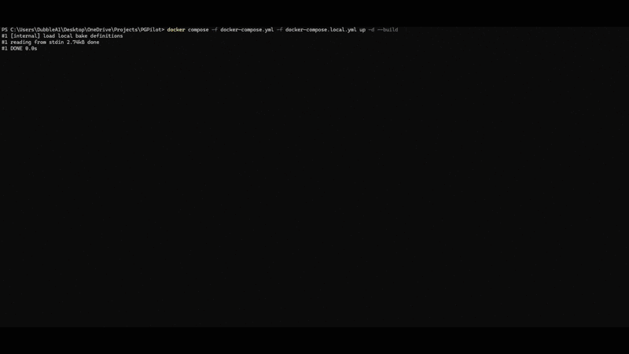
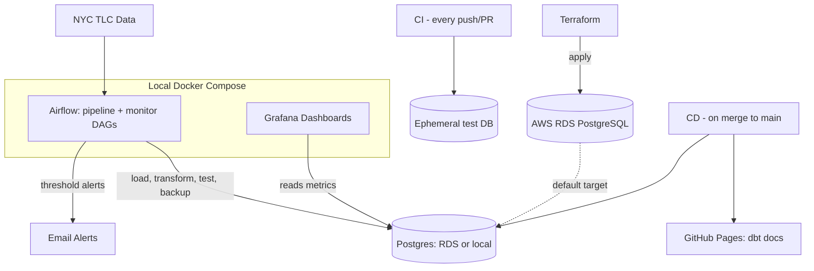
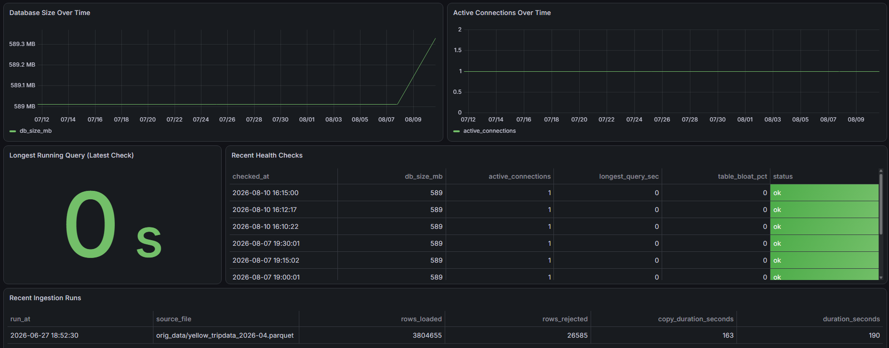

# PGPilot

> *A PostgreSQL operations platform built on 3.8M real NYC taxi trip records — provisioned on AWS RDS via Terraform, orchestrated with Apache Airflow, tested with dbt, monitored with Grafana, and shipped through a full CI/CD pipeline. Runs in the cloud, or fully locally with one command.*


**[Live dbt Docs & Lineage Graph](https://herreraaron.github.io/PGPilot/)** — auto-published on every merge to `main`

## About

PGPilot is an end-to-end PostgreSQL operations platform built on 3.8M real NYC Yellow Taxi trip records. Data is ingested and validated, transformed and tested with dbt, orchestrated by Apache Airflow, deployed to AWS RDS via Terraform, monitored through Grafana, and shipped through a real CI/CD pipeline — all runnable locally with a single command, or in the cloud exactly as it would run in production. It was built to demonstrate the concepts a platform/DevOps role actually touches day to day: infrastructure as code, orchestration, observability, and automated deployment — not just application code.



*One command brings up Postgres, Airflow, and Grafana together — no cloud account, no secrets, no setup.*

## Key Results

- Ingested and cleaned **3.8M real trip records**, automatically rejecting invalid rows (0.69%) against documented business rules
- Cut query latency **up to 5.5x** through targeted post-load indexing, measured with `EXPLAIN ANALYZE`
- **13 automated data-quality tests** (uniqueness, referential integrity, accepted values, freshness) via dbt, gating every pipeline run
- Verified disaster recovery **end-to-end**: table drop → restore → row/constraint parity confirmed
- Real **CI/CD**: 3 independent CI checks on every push/PR, a 2-stage CD deploy on every merge to `main`, gated by branch protection
- Production-shaped cloud infrastructure — AWS RDS + networking — provisioned from a **single Terraform apply**
- A 5-panel Grafana dashboard and a live, auto-published documentation site, both fully **provisioned as code**
- A **one-command, fully local** reproduction of the entire stack — zero AWS account required

## Architecture



## Skills & Concepts Demonstrated

| Category | Demonstrated Via |
|---|---|
| Infrastructure as Code | Terraform (providers, resources, state, plan/apply/destroy); AWS RDS, VPC, subnet groups, security groups |
| CI/CD | GitHub Actions; multi-job pipelines; branch protection; secrets management; environment-gated deploys |
| Orchestration | Apache Airflow; DAGs and operators; explicit task dependencies; fail-fast data-quality gates |
| Data Engineering | Python/pandas/psycopg2 ETL; bulk-loading via `COPY`; data validation; index performance tuning |
| Data Modeling & Testing | dbt staging/mart models; automated data-quality tests; source freshness; lineage documentation |
| Observability | Grafana dashboards-as-code; custom health-check monitoring; threshold-based alerting |
| Backup & Recovery | `pg_dump`/`pg_restore`; verified restore drills; retention and log rotation policies |
| Containerization | Docker & Docker Compose; multi-service orchestration; local/cloud environment parity |
| Scripting | Bash (backup, restore, log rotation) and Python, both still the actual execution layer under Airflow |
| Documentation | Static site generation and CI/CD-driven publishing (dbt docs → GitHub Pages) |

## Tech Stack

| Tool | Role |
|---|---|
| PostgreSQL 16 | Primary database (AWS RDS) |
| Terraform | Infrastructure as code — provisions RDS, networking |
| AWS (RDS, VPC) | Managed database hosting and networking |
| Python, pandas, psycopg2 | Data ingestion and monitoring pipeline |
| Apache Airflow | Pipeline orchestration and scheduling |
| dbt (dbt-postgres) | SQL transformation, testing, and documentation |
| Bash | Backup, restore, and log management scripts |
| Docker, Docker Compose | Containerization |
| GitHub Actions | CI/CD pipeline, GitHub Pages publishing |
| Grafana | Operational dashboards, provisioned as code |

## How It Works

**Data ingestion & cleaning.** [scripts/load_data.py](scripts/load_data.py) cleans raw NYC TLC trip data against documented rules (no negative fares, no zero-passenger completed trips, valid zone references) and bulk-loads it with Postgres's native `COPY` — 3,804,655 of 3,831,240 rows loaded. Indexes are added *after* the load and benchmarked, cutting range-query time up to 5.5x.

**Transformation & testing (dbt).** Staging and mart models sit on top of the raw load without touching the original cleaning logic, and 13 automated tests (uniqueness, referential integrity, accepted values, freshness) run on every build — a failing test blocks the pipeline before anything downstream happens.

**Orchestration (Airflow).** Two DAGs replace the project's original `cron` scheduler: a five-task monthly pipeline (`load → validate → transform → test → backup`) with fail-fast data-quality gates, and an independent 15-minute health-monitoring DAG.

**Backup & recovery.** Bash-driven `pg_dump`/`pg_restore` with 7-day rotation, triggered automatically only after a load and its dbt tests both pass. Restore integrity is verified end-to-end — drop a table, restore, confirm rows/constraints/indexes match.

**Cloud infrastructure (Terraform + AWS).** A single `terraform apply` provisions a production-shaped AWS RDS instance, VPC networking, and an SSL-enforcing parameter group, with cost/security tradeoffs made deliberately (see below).

**CI/CD (GitHub Actions).** CI runs three independent checks — pipeline + dbt tests, Terraform validation, DAG import checks — against a disposable database on every push/PR. CD deploys dbt models to the live database and publishes a fresh dbt docs site to GitHub Pages on every merge to `main`, gated by required status checks and branch protection.

**Observability (Grafana + monitoring).** A 5-panel Grafana dashboard, provisioned entirely as code, visualizes database size, connections, query performance, and ingestion history. A separate Python monitor polls four health metrics every 15 minutes and sends threshold-based email alerts.

## Screenshots

| | |
|---|---|
|  *Grafana operations dashboard* |  *dbt docs lineage graph* |
|  *A completed Airflow pipeline run* |  *Threshold-based email alert* |

## Getting Started

**Fastest way to see it running** — no AWS account, no secrets:

```
cp .env.example .env
docker compose -f docker-compose.yml -f docker-compose.local.yml up -d --build
```

Airflow: `http://localhost:8080` (`airflow`/`airflow`) — unpause the DAGs and trigger a run.
Grafana: `http://localhost:3000` (`admin`/`admin`) — the dashboard loads automatically.

**Cloud path**: `terraform apply` (see [terraform/](terraform/)) provisions real AWS RDS infrastructure; the same Docker Compose stack then points at it instead of the local database via `.env`.

Manual data-loading, dbt, backup, and monitoring commands live in [scripts/](scripts/) and [dbt/](dbt/).

## From V1 to V2

This project began as a smaller, single-machine tool: Bash scripts (`pg_dump`/`pg_restore`, log rotation) scheduled with `cron`, running against a local Postgres container. That's where the original backup/restore and Bash scripting work came from, and it's preserved in this repo's earlier history.

This version rebuilds the same operational goals around production-representative tooling: `cron` became Apache Airflow, the local-only database became a Terraform-provisioned AWS RDS instance, and the project gained dbt, CI/CD, and Grafana. The original Bash scripts are still the actual backup/restore engine underneath — they're just orchestrated by Airflow now instead of `cron`.

## Engineering Tradeoffs & Future Improvements

- **RDS is publicly accessible**, secured by password + enforced SSL rather than network isolation — a deliberate portfolio-scale simplification. Production would use a private subnet with a bastion host or VPN.
- **Secrets live in gitignored Terraform state, not AWS Secrets Manager** — avoids a small recurring cost. `manage_master_user_password` would be the production-grade choice.
- **Backup retention is a flat 7-day window**, not Grandfather-Father-Son tiering — sufficient at this data scale, not at production scale.
- **Grafana visualizes; it doesn't alert.** SMTP alerting is handled separately by the monitor script; production would likely consolidate both.
- **Terraform changes are validated in CI but not applied by CD** — doing so would require a remote state backend, deliberately out of scope here.
- **LocalExecutor caps Airflow at one machine** — `CeleryExecutor`/`KubernetesExecutor` would be the path to scale out task execution.

## Author

**Aaron Herrera** — [LinkedIn](https://www.linkedin.com/in/aaronherrera4/)
