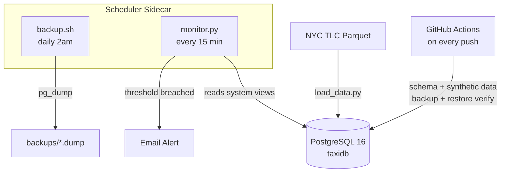

# PGPilot

>*A PostgreSQL operations toolkit built on real NYC taxi data that covers data ingestion, automated backups, health monitoring, and CI.*


## About
PGPilot is a database operations toolkit built around a real-world NYC taxi dataset. The primary purpose of this project was to learn and build my skills in concepts commonly seen in DevOps roles. This includes things like containerization, continuous integration, monitoring and logging, and automation.

## Features

- Ingested and cleaned 3.8M rows of real NYC Yellow Taxi trip data, rejecting 26,585 rows (0.69%) based on documented business logic rules
- Bulk-loaded data using Postgres's native `COPY` command, then benchmarked index performance before and after with `EXPLAIN ANALYZE`
- Automated daily `pg_dump` backups with 7-day rotation, log management, and a dedicated scheduler sidecar running on a cron schedule
- Verified restore integrity end-to-end: drops the `trips` table, restores from the dump, then confirms row counts, foreign key constraints, and indexes all match the pre-drop state
- Monitors four database health metrics via Postgres system views with threshold-based SMTP email alerting
- GitHub Actions CI pipeline that applies schema initialization scripts, loads synthetic data, and runs a full backup/restore cycle on every push

## Tech Stack

| Tool | Role |
|---|---|
| PostgreSQL 16 | Primary database |
| Python, pandas, psycopg2 | Data ingestion and monitoring pipeline |
| Bash | Backup, restore, and log management scripts |
| Docker, Docker Compose | Containerization and scheduler sidecar |
| GitHub Actions | CI pipeline |
| smtplib | SMTP email alerting |

## Architecture



## Loading Data

[scripts/load_data.py](scripts/load_data.py) is a data engineering pipeline that ingests NYC TLC's public Yellow Taxi Trip Records, cleans them, and bulk-loads them into Postgres. It turns a single month of data (~3.8M rows) into a realistic operational dataset for testing backup, monitoring, and performance-tuning workflows.

### Data cleaning

Several rows in the dataset were dropped due to containing logical errors.

| Rule | Reasoning |
|---|---|
| `fare_amount < 0` / `total_amount < 0` | A fare cannot be negative |
| `passenger_count = 0` | A completed fare implies at least one rider. Nulls are kept since they represent a real, documented "Flex Fare" trip type with no metered passenger count, not bad data. |
| `dropoff_datetime < pickup_datetime` | A trip cannot end before it starts |
| pickup outside the file's month | Catches a handful of mis-keyed dates (e.g. timestamps decades off) |
| null pickup/dropoff zone | Required to satisfy the FK into the `zones` lookup table |

On the April 2026 file: **3,831,240 rows read → 3,804,655 loaded, 26,585 rejected (0.69%)**, the bulk of which were negative fare/total amounts.

### Bulk loading

Rows are loaded with psycopg2's `copy_expert()` (Postgres's native `COPY ... FROM STDIN`) rather than row-by-row `INSERT`s. The entire cleaned dataset is staged into an in-memory CSV buffer and streamed to Postgres in one pass. This method is significantly more efficient than row-by-row inserts.

### Indexing and performance tuning

Indexes on `pickup_datetime` and `total_amount` are added **after** the bulk load, not before. Building them during the load would force Postgres to update both indexes on every inserted row, slowing down the process. Before/after performance is measured directly with `EXPLAIN ANALYZE` and logged to an `index_benchmark` table:

| Query | Before (Seq Scan) | After (Index Scan) | Speedup |
|---|---|---|---|
| `pickup_datetime` between date range | 152.70 ms | 27.96 ms | **5.5x** |
| `total_amount > 100` | 235.79 ms | 183.76 ms | **1.3x** |

The two indexes deliver very different speedups despite similarly selective queries. `pg_stats.correlation` explains why: `pickup_datetime` is `0.68` (rows were loaded in roughly chronological order, so matching rows sit on a small number of adjacent disk pages) versus `0.15` for `total_amount` (high-fare trips are scattered randomly across the table, so even a precise index still has to fetch from thousands of scattered pages). An index's payoff depends on how well the indexed column correlates with the table's physical row order, not just on how selective the query is.

### Auditability

Every run of `load_data.py` records its own row counts, rejection counts, and timing breakdown to a `load_log` table, giving a persistent, queryable history of every load rather than relying on console output or memory.

## Backup & Recovery

[scripts/backup.sh](scripts/backup.sh) and [scripts/restore.sh](scripts/restore.sh) handle backing up and recovering the database via `pg_dump`/`pg_restore`, run through `docker exec` rather than requiring Postgres client tools installed on the host.

**Manual backup:**

```
./scripts/backup.sh
```

This dumps the database to a timestamped, compressed file in `backups/` (e.g. `taxidb_20260627_194658.dump`, ~72MB for the full ~3.8M-row dataset), logs the run to `logs/backup.log`, and deletes any `.dump` file older than 7 days.

**Manual restore:**

```
./scripts/restore.sh ./backups/taxidb_20260627_194658.dump
```

`restore.sh` uses `pg_restore --clean --if-exists`, so it safely drops and recreates only the objects present in the dump before reloading data. This includes any tables, indexes, or foreign keys that may have been dropped or modified since the backup was taken.

### Verified restore test

Tested end-to-end: dropped the `vendors` table entirely (cascading its foreign key into `trips`), then ran `restore.sh` against a prior backup. Both the table and the FK constraint were recreated automatically, and row counts matched exactly.

### Backup rotation

`.dump` files older than 7 days are deleted automatically on each `backup.sh` run via `find ... -mtime +7 -delete`. Recent backups are never touched.

### Log rotation

Backup rotation (pruning old `.dump` files) and log rotation (managing `backup.log` growth) are handled separately. Once `backup.log` exceeds 1MB, it's archived to a timestamped `.old` file and a fresh log starts. Archived logs older than 30 days are pruned on the next run.

### Scheduling

Native Windows has no `cron`, so runs are scheduled in a dedicated `scheduler` container instead ([scheduler/Dockerfile](scheduler/Dockerfile), [scheduler/crontab](scheduler/crontab)). It's a small sidecar, separate from the database container, whose only job is running `cron` and triggering the existing, unmodified `backup.sh`/`restore.sh` on a real schedule:

```
# Daily backup at 2am
0 2 * * * root /app/scripts/backup.sh >> /app/logs/cron.log 2>&1

# Weekly summary every Sunday at 9am - last 20 lines of the backup log
0 9 * * 0 root tail -n 20 /app/logs/backup.log >> /app/logs/weekly_summary.log 2>&1
```

Since `cron` runs inside the container rather than on the host OS, the schedule works identically on any machine. The sidecar mounts the Docker socket and the project directory, so backups and logs land directly on the host filesystem. Verified end-to-end by triggering `backup.sh` through the sidecar and confirming the resulting `.dump` file appeared on the host.

## Health Monitoring & Alerting

[scripts/monitor.py](scripts/monitor.py) polls the database every 15 minutes via the `scheduler` sidecar, collects four health metrics from Postgres's built-in system views, and sends an email alert if any metric crosses a warning or critical threshold.

**Manual run:**

```
python scripts/monitor.py
```

Use `--dry-run` to verify the full pipeline without sending email:

```
python scripts/monitor.py --dry-run
```

### What is monitored

| Metric | Why it matters |
|---|---|
| `db_size_mb` | Catches runaway data growth before it fills the disk |
| `active_connections` | Postgres has a hard connection cap; exhausting it refuses all new connections |
| `longest_query_sec` | A query running longer than expected is usually blocking others or missing an index |
| `table_bloat_pct` | Dead rows accumulate until VACUUM reclaims them; high bloat degrades query performance |

### Persistent history

Every run inserts a row into `db_metrics` regardless of status, giving a queryable record of database health over time. This makes it possible to spot gradual trends that a single snapshot wouldn't reveal.


*Monitoring results stored in the db_metrics table.*

### Alerting

When any metric crosses a threshold, an email is sent via SMTP with the metric values and status level. Thresholds are defined as named constants at the top of [scripts/monitor.py](scripts/monitor.py) and can be tuned to match the environment's normal baseline. `--dry-run` prints the alert body to the terminal instead of sending, making it safe to test without live email credentials.


*Alert sent to email when critical threshold is surpassed.*

### Scheduling

The monitor runs every 15 minutes via the existing `scheduler` sidecar alongside the backup jobs. Output from each automated run is appended to `logs/monitor.log`.

## Continuous Integration

[.github/workflows/ci.yml](.github/workflows/ci.yml) runs on every push and pull request. It spins up a real Postgres 16 instance, applies every schema migration from `init/`, loads 1,000 synthetic rows, runs the health monitor in dry-run mode, and runs a full backup and restore verification cycle.

### Synthetic data for CI

The original dataset is a 600MB parquet file that is gitignored. `load_data.py` generates synthetic rows deterministically and inserts them through the same COPY pipeline, so CI exercises the real load path without committing large files to the repo.

### Backup and restore verification

After backup.sh produces a dump, the pipeline drops the trips table, restores from the dump, then confirms that row counts, foreign key constraints, and indexes all match the pre-drop state.

## What I Learned

**PostgreSQL Internals**: 
- How `pg_stat_activity`, `pg_stat_user_tables`, and `pg_database_size()` expose the live database state
- Why `EXPLAIN ANALYZE` output varies based on physical row order (`pg_stats.correlation`)
- How dead tuples accumulate and why `VACUUM` matters for query performance

**Data Engineering**:
- Cleaning a real-world dataset with non-obvious rules (keeping null passenger counts, filtering by derived month bounds)
- Why `COPY ... FROM STDIN` is faster than row-by-row inserts
- Why indexes are built after a bulk load, not before

**Backup and Recovery**:
- Using `pg_dump -Fc` (custom format) for compressed, restore-friendly dumps vs plain SQL exports
- `pg_restore --clean --if-exists` for safe restores that handle partially dropped schemas
- Separating backup rotation from log rotation since they have different retention windows and failure modes

**Docker and Containerization**:
- The sidecar pattern for running `cron` alongside a database without modifying the database image
- Mounting the Docker socket so a container can exec into a sibling container
- How Docker volumes persist data independently of container lifecycle

**Observability**:
- The difference between polling-based monitoring and event-driven alerting, and where polling breaks down
- Storing metric history in a table to surface trends that a single snapshot misses
- Using `--dry-run` flags to test alert logic safely in any environment

**CI**:
- Why environment parity matters (i.e. code that passes locally but fails in CI usually means an undeclared dependency)
- Client-side vs server-side `COPY` and why they behave differently across environments
- Using `CI=true` as a branch point to adapt scripts without duplicating logic


## What Can Be Improved

- **Backup retention (GFS tiering).** `backup.sh` uses a flat 7-day window. Production systems typically use Grandfather-Father-Son rotation (i.e. daily backups for a week, weekly for a month, monthly for a year) so long-term recoverability doesn't require keeping every daily snapshot indefinitely. This wasn't implemented here since the storage-growth problem doesn't exist at this project's scale.

- **Polling-based monitoring has a blind spot.** `monitor.py` captures a snapshot every 15 minutes, so an incident that starts and resolves between checks goes undetected. In production this is addressed by shortening the interval (Prometheus scrapes every 15–30 seconds) or replacing polling with event-driven alerting entirely. At this project's scale the trade-off is acceptable, but it's worth understanding the gap.

- **Schema migrations.** The `init/` scripts only run on first volume creation, which works for a clean setup but doesn't support evolving the schema without dropping all data. A migrations tool like Flyway or Alembic would manage incremental schema changes safely in a long-lived production database.

## Getting Started

1. Copy `.env.example` to `.env` and fill in your credentials:
   ```
   cp .env.example .env
   ```
2. Start the database and scheduler:
   ```
   docker compose up -d
   ```
3. Verify both containers are healthy:
   ```
   docker compose ps
   ```
4. Connect with `psql`:
   ```
   docker exec -it taxidb-postgres psql -U taxiuser -d taxidb
   ```

The schema in [init/01_schema.sql](init/01_schema.sql) is applied automatically the first time the `pgdata` volume is created. If you change the schema after the volume already exists, drop the volume (`docker compose down -v`) and start again.

**Load data** — download the [April 2026 NYC TLC Yellow Taxi parquet file](https://www.nyc.gov/site/tlc/about/tlc-trip-record-data.page) into `orig_data/`, then:

```
python -m venv .venv
.venv\Scripts\activate
pip install -r requirements.txt
python scripts/load_data.py
```

**Run the health monitor manually:**

```
python scripts/monitor.py --dry-run
```

Remove `--dry-run` to send a real email alert. Requires `ALERT_EMAIL`, `SMTP_USER`, and `SMTP_PASSWORD` to be set in `.env`.

**Run a manual backup:**

```
./scripts/backup.sh
```

**Restore from a backup:**

```
./scripts/restore.sh ./backups/<filename>.dump
```

## Author

**Aaron Herrera** — [GitHub](https://github.com/HerrerAaron) · [LinkedIn](https://www.linkedin.com/in/aaronherrera4/)
